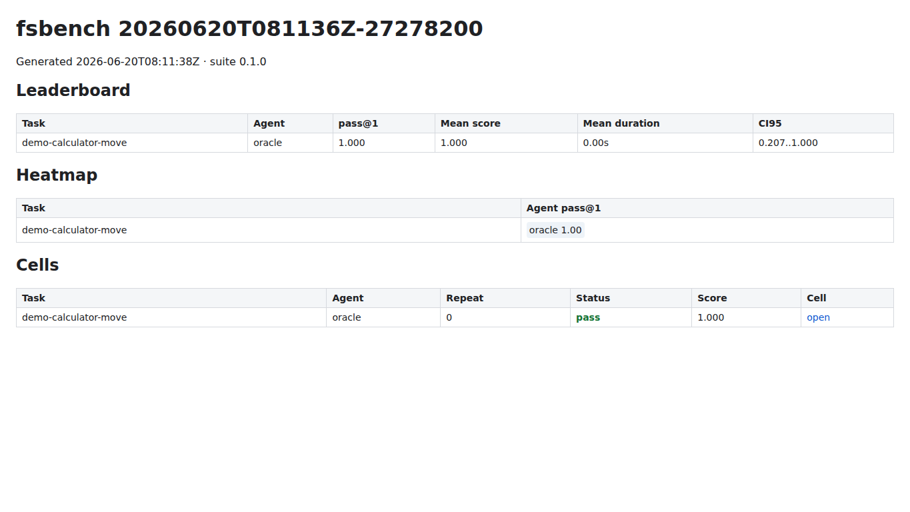

# fsbench

`fsbench` is a local benchmark harness for CLI coding agents. Each cell starts from a clean Python task workspace: the
agent edits files, deterministic checks run, and the reports stay available without rerunning anything.

The project is intentionally file-state based. No model is asked to judge the answer. If a run passes, it is because the
resulting workspace passed the checks declared by the task.



The screenshot above was generated from the included `demo-calculator-move` task with the built-in `oracle` adapter.

## Why this exists

Agent benchmarks get messy quickly. A useful harness has to keep task setup, process cleanup, hidden checks, artifacts,
cost data, and report generation in one repeatable loop. `fsbench` is the small version of that loop: local first,
SQLite backed, and strict about evaluating code instead of prose.

The questions it tries to keep honest are practical:

- Did this agent actually fix the files, or just explain the fix?
- Which tasks are flaky across repeats?
- Did a new prompt, model, adapter version, or sandbox setting regress a known corpus?
- What changed in the workspace when a cell failed?

## What it does

- Builds a matrix of `task x agent x repeat`.
- Creates a fresh workspace for every cell from `workspace.zip`.
- Runs agents through CLI adapters: `oracle`, `codex`, `aider`, `claude`, `opencode`, and `pi`.
- Evaluates the final files with deterministic checks such as `pytest`, `ruff`, `mypy`, AST checks, content checks,
  diff limits, integrity checks, and test-tamper detection.
- Stores results in SQLite first, then exports JSON, JSONL, CSV, and HTML reports.
- Supports resume by task, agent, repeat, seed, task version hash, and environment manifest hash.
- Scrubs known secrets before writing logs, reports, and artifacts.

## Install

`fsbench` requires Python 3.12.

```bash
python3 -m venv .venv
source .venv/bin/activate
python -m pip install -e ".[dev]"
```

On systems where Python is installed as `python`, use `python` instead of `python3` for the first command.

## Quick start

Run the built-in health check and validate the bundled open tasks:

```bash
fsbench doctor --agents oracle
fsbench validate --tasks tasks/open
```

Run one demo cell and generate the report:

```bash
fsbench run \
  --agents oracle \
  --tasks tasks/open/demo-calculator-move \
  --repeats 1 \
  --run-dir runs/demo

fsbench report --run-dir runs/demo
```

Open `runs/demo/index.html` in a browser. The same run directory also contains `report.json`, `runs.jsonl`,
`report.csv`, `aggregates.csv`, `runs.sqlite`, per-cell pages, logs, diffs, and sanitized artifacts.

## Running real agents

`oracle` is a pseudo-agent that overlays the task's reference solution. Use it mainly to validate the corpus and the
harness.

Real adapters call local CLI tools. `fsbench` will not install those tools for you, and it skips unavailable adapters
instead of pretending the run happened.

For local comparisons, use `--agent-env host`. In this mode agents see the same `HOME` and environment as your shell, so
CLI logins, subscriptions, and config files such as `~/.codex`, `~/.claude`, or `~/.pi` work normally. The process still
runs from the temporary task workspace, not from the `fsbench` repository.

```bash
fsbench doctor --agents codex,aider,claude,opencode,pi
fsbench run \
  --agent-env host \
  --agents codex,aider,claude,opencode,pi \
  --tasks tasks/open \
  --repeats 5 \
  --run-dir runs/real-agents
```

Use agent aliases when you need separate results for different models. The alias is what appears in SQLite, JSON, CSV,
HTML reports, and artifact paths.

```toml
[agents]
pi_kimi25 = "pi:kimi-k2.5"
pi_kimi26 = "pi:kimi-k2.6"
pi_kimi27 = "pi:kimi-k2.7"
opencode_kimi25 = "opencode:moonshot/kimi-k2.5"
opencode_kimi26 = "opencode:moonshot/kimi-k2.6"
opencode_kimi27 = "opencode:moonshot/kimi-k2.7"
codex_gpt52 = "codex:gpt-5.2"
codex_gpt55 = "codex:gpt-5.5"
```

```bash
fsbench run \
  --agent-env host \
  --agents pi_kimi25,pi_kimi26,pi_kimi27,opencode_kimi25,opencode_kimi26,opencode_kimi27 \
  --tasks tasks/open \
  --repeats 5 \
  --run-dir runs/kimi-compare

fsbench report --run-dir runs/kimi-compare
fsbench leaderboard --report runs/kimi-compare/report.json
```

Run Codex model comparisons separately with OpenAI models:

```bash
fsbench run \
  --agent-env host \
  --agents codex_gpt52,codex_gpt55 \
  --tasks tasks/open \
  --repeats 5 \
  --run-dir runs/codex-gpt-compare
```

You can put the environment mode in `fsbench.toml` instead of passing `--agent-env host` every time:

```toml
base_seed = 42
parallel = 4
sandbox = "process"
agent_env = "host"
```

The default environment mode is `isolated`. Use provider settings only when you intentionally want isolated runs with a
fake home and selected environment variables:

```toml
[providers.pi]
env_allowlist = ["KIMI_API_KEY"]

[providers.codex]
env_allowlist = ["OPENAI_API_KEY"]
required_env = ["OPENAI_API_KEY"]
base_url_env = "OPENAI_BASE_URL"
max_parallel = 2

[report]
keep_artifacts = true
inline_diff_max_bytes = 65536
```

## Reports

The HTML report is meant for browsing results after a run. The JSON and CSV files are meant for scripts and publishing.

Useful commands:

```bash
fsbench leaderboard --report runs/demo/report.json
fsbench inspect --run-dir runs/demo --task demo-calculator-move --agent oracle --repeat 0
fsbench compare runs/before/report.json runs/after/report.json --by-task
```

Each aggregate includes `pass@1`, published `pass@k` values where enough repeats exist, a Wilson 95 percent confidence
interval for `pass@1`, mean score, mean duration, and best-effort cost metrics when the adapter exposes them.

## Task layout

A task is just a directory with a manifest, a prompt, a zipped starting workspace, optional hidden checks, and an oracle
solution:

```text
tasks/open/my-task/
  task.yaml
  prompt.md
  workspace.zip
  solution/
  hidden/
  CALIBRATION.md
```

Create a scaffold:

```bash
fsbench new-task my-task --root tasks/open
```

Then edit `task.yaml`, `prompt.md`, the starting workspace, the hidden files, and the reference solution. A good task
has one broken base state, one passing oracle solution, and checks that describe the behavior you actually care about.

Validate one task before adding it to a run:

```bash
fsbench validate --tasks tasks/open/my-task
```

## Safety model

Treat agent processes as untrusted. They can edit workspace files, spawn subprocesses, weaken visible tests, print
secrets, try network access, and leave background processes.

The default `process` backend is not a security sandbox. It gives every cell an isolated directory, a fake home,
deterministic environment variables, timeout handling, and process-tree cleanup. On Linux, use `--sandbox bwrap` for a
stricter boundary when Bubblewrap is available.

Hidden tests are hidden from the agent during a run. They are not hidden from someone who can read this repository.

## Development

Common checks:

```bash
ruff format --check
ruff check
mypy --strict src tests
coverage run -m pytest
coverage report
```

The CI workflow runs linting, strict typing, tests, task validation, and an oracle smoke run on Linux and macOS.

## Project status

This repository is the `0.1.0` MVP. The MVP includes 15 open Python tasks, the CLI commands needed for local
benchmarking, SQLite-backed reporting, and adapters for `oracle`, `codex`, `aider`, `claude`, `opencode`, and `pi`.

Docker sandboxing is intentionally a placeholder in this version. Use `process` for local convenience and `bwrap` on
Linux when you need a stronger boundary.

## License

MIT.
